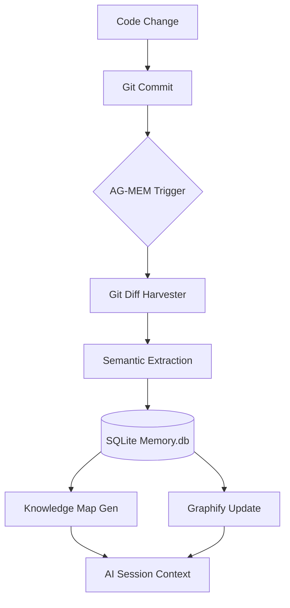

# 🤖 Antigravity Memory Protocol (AG-MEM)

[](https://www.python.org/)
[](https://opensource.org/licenses/MIT)
[](#how-it-works)

> **"Give your AI Agent a brain that never forgets your architectural decisions."**

**Antigravity Memory Protocol (AG-MEM)** is a high-performance, repository-native knowledge management system. It bridges the gap between raw code changes and long-term architectural understanding, ensuring your AI Agent (like Google Antigravity, Claude, or GPT) remains contextually aware of *why* and *how* your project evolves.

---

## 🌐 Language Support
- [🇮🇩 Bahasa Indonesia](./README_ID.md)
- [🇺🇸 English (Current)](#)

---

## 🧠 Why AG-MEM?

Most AI Agents suffer from "Knowledge Drift"—as the project grows, they lose track of past decisions made in previous sessions. AG-MEM solves this by:
1. **Persistent Memory**: Storing every logic change in a structured SQLite database.
2. **Context Continuity**: Generating living documentation (`KNOWLEDGE_MAP.md`) that acts as a "State of the Union" for the AI.
3. **Graph Awareness**: Building a semantic graph of your codebase using `Graphify`.

---

## 🔄 How It Works

AG-MEM operates as a "Silent Librarian" in your repository. Here is the operational flow:

### 1. The Workflow Loop



### 2. Operational Phases
1.  **Harvesting Phase**: Triggered after a commit, the system analyzes `git diff`. It doesn't just see "lines added," it understands "logic changed" (e.g., *Refactored Auth Service to use Supabase RPC*).
2.  **Persistence Phase**: Metadata and semantic observations are saved to `.agent/memory.db`.
3.  **Visualization Phase**: The system updates `KNOWLEDGE_MAP.md`, providing a human-and-AI-readable history of the project.
4.  **Relational Phase**: `Graphify` links these observations into a nodes-and-edges graph, allowing the AI to "travel" through dependencies.

---

## 📊 Comparison with Other Systems

| Feature | **Antigravity-Mem** | **MemPalace** | **Claude-Mem** |
| :--- | :--- | :--- | :--- |
| **Integration** | **Repo-Native (Git)** | Local Desktop | MCP Server |
| **Automation** | **Auto-Harvesting** | Manual Notes | Retrieval-based |
| **Setup Cost** | **Zero (Single Script)** | High (Application) | Medium (Config) |
| **Graph Logic** | **Native Graphify** | Limited | None |
| **AI Agnostic** | Yes (Markdown Based) | No (UI Based) | Yes (MCP) |
| **Primary Goal** | **Repo Intelligence** | Personal Knowledge | Message History |

---

## 🚀 Quick Start

### 1. Installation
Clone this repository or copy the files to your project root, then run:
```powershell
python setup.py
```
*The installer will automatically configure your project structure and install `graphify`.*

### 2. Initialization
If you have an existing project, choose **"Y"** during setup to perform a **Backfill Scan**. AG-MEM will digest your current codebase to build an instant knowledge base.

### 3. Activating the Protocol
Tell your AI Agent:
> "Activate **Automated Memory Protocol** from `.agent/rules/GEMINI.md`. Sync knowledge after every commit."

---

## 🎯 Common Use Cases

- **AI Onboarding**: When a new AI session starts, it reads `KNOWLEDGE_MAP.md` and immediately knows the current state of the project without scanning thousands of lines.
- **Decision Tracking**: Understand *why* a specific RPC was created 3 months ago.
- **Refactoring Safety**: The AI can check if a new change contradicts previous architectural decisions stored in the Memory DB.
- **Technical Debt Audit**: Automatically track areas of the code that are frequently changed or marked as "workarounds" in commit messages.

---

## 📁 Repository Architecture

```plaintext
root/
├── .agent/
│   ├── rules/
│   │   └── GEMINI.md          # Protocol Enforcement Rules
│   ├── scripts/
│   │   └── antigravity_mem/   # Core Logic (Harvester, Backfill)
│   └── memory.db              # SQLite Knowledge Storage
├── scripts/
│   └── sync_knowledge.py      # Main Orchestrator (The "Librarian")
└── setup.py                   # One-Click Installer
```

---

## 🛡️ Principles
- **Privacy First**: All data is stored locally in `.agent/`. No data leaves your machine.
- **Minimal Overhead**: Scripts are optimized to run in milliseconds.
- **Living Docs**: No more stale READMEs. Your documentation evolves with your code.

---

*Built for the next generation of Agentic Workflows.*
*Maintained by the **Antigravity AI** community.*

