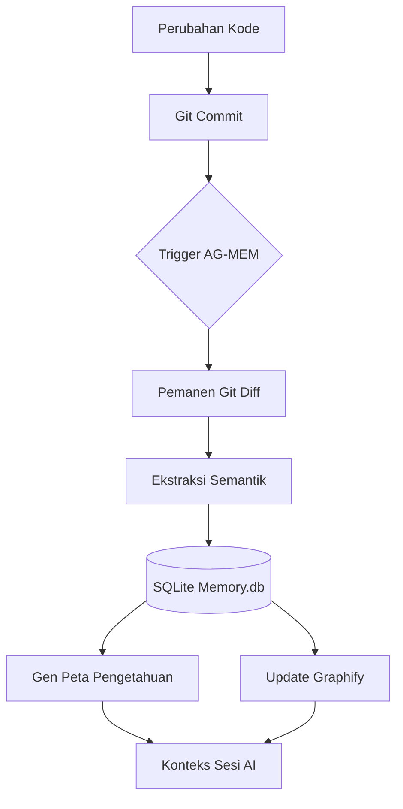

# 🤖 Antigravity Memory Protocol (AG-MEM)

[](https://www.python.org/)
[](https://opensource.org/licenses/MIT)
[](#cara-kerja)

> **"Berikan AI Agent Anda 'otak' yang tidak pernah lupa pada keputusan arsitektur Anda."**

**Antigravity Memory Protocol (AG-MEM)** adalah sistem manajemen pengetahuan berbasis repositori yang dirancang untuk performa tinggi. Sistem ini menghubungkan antara perubahan kode mentah dengan pemahaman arsitektur jangka panjang, memastikan AI Agent Anda (seperti Google Antigravity, Claude, atau GPT) tetap sadar akan konteks *mengapa* dan *bagaimana* proyek Anda berkembang.

---

## 🌐 Dukungan Bahasa
- [🇺🇸 English](./README.md)
- [🇮🇩 Bahasa Indonesia (Sekarang)](#)

---

## 🧠 Mengapa AG-MEM?

Kebanyakan AI Agent menderita "Knowledge Drift"—seiring berkembangnya proyek, mereka kehilangan jejak keputusan masa lalu yang dibuat di sesi sebelumnya. AG-MEM menyelesaikan ini dengan:
1. **Memori Persisten**: Menyimpan setiap perubahan logika dalam database SQLite yang terstruktur.
2. **Kontinuitas Konteks**: Menghasilkan dokumentasi hidup (`KNOWLEDGE_MAP.md`) yang berfungsi sebagai "State of the Union" bagi AI.
3. **Kesadaran Graf**: Membangun graf semantik dari codebase Anda menggunakan `Graphify`.

---

## 🔄 Cara Kerja

AG-MEM beroperasi sebagai "Pustakawan Senyap" di repositori Anda. Berikut adalah alur operasionalnya:

### 1. Loop Alur Kerja



### 2. Fase Operasional
1.  **Fase Harvesting**: Dipicu setelah commit, sistem menganalisis `git diff`. Sistem tidak hanya melihat "baris yang ditambah," tetapi memahami "logika yang berubah" (misal: *Refaktor Layanan Auth untuk menggunakan Supabase RPC*).
2.  **Fase Persistensi**: Metadata dan observasi semantik disimpan ke `.agent/memory.db`.
3.  **Fase Visualisasi**: Sistem memperbarui `KNOWLEDGE_MAP.md`, memberikan riwayat proyek yang dapat dibaca oleh manusia maupun AI.
4.  **Fase Relasional**: `Graphify` menghubungkan observasi ini ke dalam graf node-dan-edge, memungkinkan AI untuk "menjelajah" melalui dependensi.

---

## 📊 Perbandingan dengan Sistem Lain

| Fitur | **Antigravity-Mem** | **MemPalace** | **Claude-Mem** |
| :--- | :--- | :--- | :--- |
| **Integrasi** | **Asli Repositori (Git)** | Desktop Lokal | Server MCP |
| **Otomatisasi** | **Pemanenan Otomatis** | Catatan Manual | Berbasis Retrieval |
| **Biaya Setup** | **Nol (Script Tunggal)** | Tinggi (Aplikasi) | Menengah (Konfigurasi) |
| **Logika Graf** | **Graphify Bawaan** | Terbatas | Tidak Ada |
| **Agnostik AI** | Ya (Berbasis Markdown) | Tidak (Berbasis UI) | Ya (MCP) |
| **Tujuan Utama** | **Intelijen Repo** | Pengetahuan Pribadi | Riwayat Pesan |

---

## 🚀 Cara Mulai Cepat

### 1. Instalasi
Clone repositori ini atau salin file ke root proyek Anda, lalu jalankan:
```powershell
python setup.py
```
*Installer akan secara otomatis mengonfigurasi struktur proyek dan menginstal `graphify`.*

### 2. Inisialisasi
Jika Anda memiliki proyek yang sudah berjalan, pilih **"Y"** saat setup untuk melakukan **Backfill Scan**. AG-MEM akan mencerna codebase Anda saat ini untuk membangun basis pengetahuan instan.

### 3. Aktivasi Protokol
Beri tahu AI Agent Anda:
> "Aktifkan **Automated Memory Protocol** dari `.agent/rules/GEMINI.md`. Sinkronkan pengetahuan setelah setiap commit."

---

## 🎯 Kasus Penggunaan Umum

- **Onboarding AI**: Saat sesi AI baru dimulai, ia membaca `KNOWLEDGE_MAP.md` dan langsung mengetahui status proyek saat ini tanpa harus memindai ribuan baris kode.
- **Pelacakan Keputusan**: Memahami *mengapa* sebuah RPC tertentu dibuat 3 bulan yang lalu.
- **Keamanan Refaktor**: AI dapat memeriksa apakah perubahan baru bertentangan dengan keputusan arsitektur sebelumnya yang tersimpan di Memory DB.
- **Audit Hutang Teknis**: Secara otomatis melacak area kode yang sering diubah atau ditandai sebagai "workaround" dalam pesan commit.

---

## 📁 Arsitektur Repositori

```plaintext
root/
├── .agent/
│   ├── rules/
│   │   └── GEMINI.md          # Aturan Penegakan Protokol
│   ├── scripts/
│   │   └── antigravity_mem/   # Logika Inti (Harvester, Backfill)
│   └── memory.db              # Penyimpanan Pengetahuan SQLite
├── scripts/
│   └── sync_knowledge.py      # Orkestrator Utama (Sang "Pustakawan")
└── setup.py                   # Installer Sekali Klik
```

---

## 🛡️ Prinsip
- **Privasi Utama**: Semua data disimpan secara lokal di `.agent/`. Tidak ada data yang keluar dari mesin Anda.
- **Overhead Minimal**: Script dioptimalkan untuk berjalan dalam hitungan milidetik.
- **Dokumen Hidup**: Tidak ada lagi README yang usang. Dokumentasi Anda berkembang bersama kode Anda.

---

*Dibangun untuk generasi berikutnya dari Alur Kerja Agentic.*
*Dikelola oleh komunitas **Antigravity AI**.*
